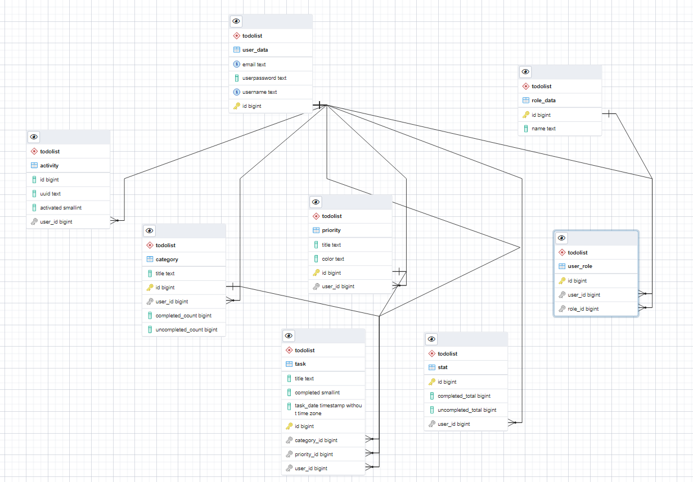
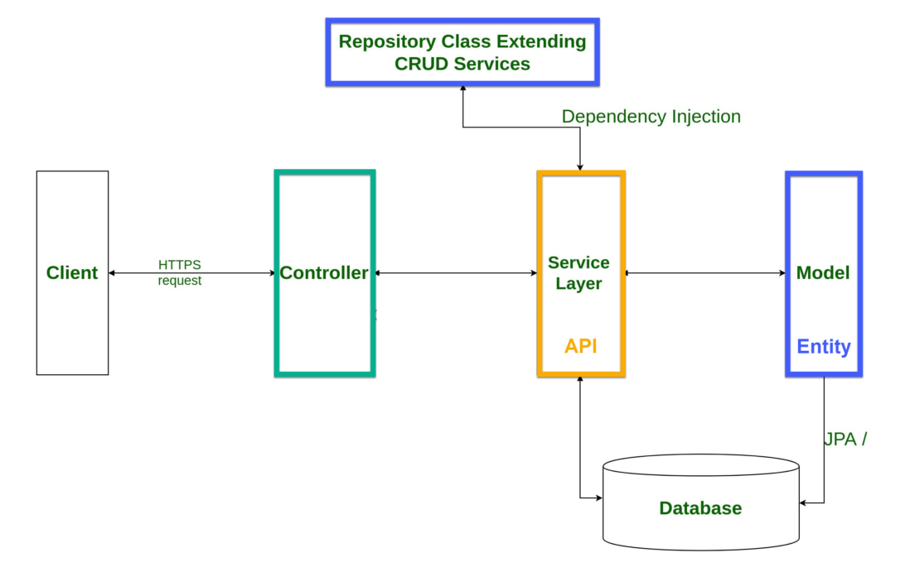

# Todo project (Eng Readme)

This project is developed in java in the IntelliJ IDEA development environment using the Spring framework, PostgreSQL and interaction with it is implemented through Postman (workkspace files are attached to it)

## Database

The database was created on the basis of Postgresql for the functionality of this project
it consists of tables:

<ol>
<li> activity - stores user activation data
<li> category - stores data by task category
<li> priority - stores data on the priority of task execution
<li> role_data - stores data by user role
<li> stat - stores data on the status of the task (completed/uncompleted)
<li> task - stores data on tasks
<li> user_data - stores user data
<li> user_role - a link for many to many communication between user_data and role_data
</ol>

## Project

The project itself is a java code using the Spring framework and connecting a database on a monolithic architecture

<ol>
<li> the repository contains all database queries
<li> services use the repository to call queries from the database, calls the necessary queries to the database and gets the result
<li> model - objects obtained from the database
<li> the controller receives a request from the client, calls the necessary methods from the service and receives a response from it
<li> the database stores the data
</ol>

## Postman

All workspace Postman files are attached to the repository. They contain all requests for interaction with the application. It remains only to import them into Postman, launch the application and enjoy its work.

# Проект Todo (Rus Readme)

Этот проект разработан на java в среде разработки IntelliJ IDEA с использованием Spring framework, PostgreSQL и взаимодействие с ним реализовано через Postman (к репозиторию прикреплены файлы workkspace)

## База данных

База данных была создана на базе Postgresql для функционала данного проекта
она состоит из таблиц:

<пр>
<li> activity - хранит данные активации пользователя
<li> category - хранит данные по категориям задач
<li> priority - хранит данные о приоритете выполнения задачи
<li> role_data - хранит данные по роли пользователя
<li> stat - хранит данные о статусе задачи (завершено/незавершено)
<li> задача - хранит данные о задачах
<li> user_data - хранит пользовательские данные
<li> user_role - ссылка для связи многих со многими между user_data и role_data
</ol>

## Проект

Сам проект представляет собой java-код, использующий Spring framework и подключающий базу данных на монолитной архитектуре

<ol>
<li> репозиторий содержит все запросы к базе данных
<li> сервисы используют репозиторий для вызова запросов из базы данных, вызывают необходимые запросы к базе данных и получают результат
<li> модель - объекты, полученные из базы данных
<li> контроллер получает запрос от клиента, вызывает необходимые методы из сервиса и получает от него ответ
<li> в базе данных хранятся данные
</ol>

## Postman

Все файлы workspace Postman прикреплены к репозиторию. Они содержат все запросы на взаимодействие с приложением. Остается только импортировать их в Postman, запустить приложение и наслаждаться его работой.